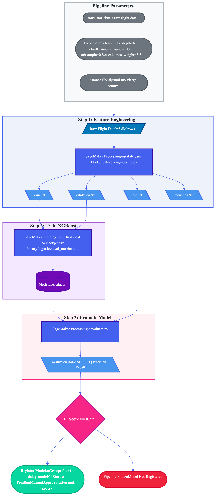

# Flight Delay Prediction — MLOps Pipeline

AAI-540 MLOps Course · Group 1 · University of San Diego

End-to-end ML pipeline for predicting U.S. domestic flight delays (>15 minutes) using AWS SageMaker and XGBoost.

**Tech Stack:** AWS SageMaker · XGBoost 1.5-1 · Python · S3 · Model Registry · Batch Transform · Model Quality Monitor · CloudWatch

---

## Table of Contents

1. [Architecture Overview](#architecture-overview)
2. [Execution Order](#execution-order)
3. [Scripts Reference](#scripts-reference)
4. [Configuration](#configuration)
5. [S3 Layout](#s3-layout)
6. [Experiment Presets](#experiment-presets)
7. [Monitoring](#monitoring)
8. [Troubleshooting](#troubleshooting)

---

## Architecture Overview

```
┌──────────────────────────────────────────────────────────────────────┐
│                     SageMaker Pipeline                               │
│                                                                      │
│  ┌─────────────┐   ┌──────────┐   ┌──────────┐   ┌──────────────┐    │
│  │  Feature    │──▶│  Train   │──▶│ Evaluate │── │F1 ≥threshold?│    │
│  │ Engineering │   │ XGBoost  │   │  Model   │   │  Condition   │    │
│  │ (Processing)│   │(Training)│   │(Process) │   │    Gate      │    │
│  └─────────────┘   └──────────┘   └──────────┘   └──────┬───────┘    │
│                                                      Yes│            │
│                                                   ┌─────▼───────┐    │
│                                                   │   Register  │    │
│                                                   │    Model    │    │
│                                                   │  (Registry) │    │
│                                                   └─────────────┘    │
└──────────────────────────────────────────────────────────────────────┘
                              │
                    Manual Approval in Studio
                              │
                 ┌────────────┴────────────┐
                 ▼                         ▼
        ┌──────────────┐         ┌──────────────┐
        │    Batch     │         │   Realtime   │
        │  Transform   │         │   Endpoint   │
        │ (Predictions)│         │ (Data Capture│
        └──────────────┘         │   Enabled)   │
                                 └──────┬───────┘
                                        │
                                 ┌──────▼───────┐
                                 │   Model      │
                                 │  Quality     │
                                 │  Monitor     │
                                 │ + CloudWatch │
                                 │   Alarm      │
                                 └──────────────┘
```



---

## Execution Order

Run these scripts sequentially. Each step depends on the output of the previous step.

| Step | Script | What It Does | Duration |
|------|--------|--------------|----------|
| 1 | `prepare-data-for-feature-engineering.py` | Cleans raw data, creates temporal splits, uploads to S3 | ~2 min |
| 2 | `pipeline_definition.py` | Defines and upserts the SageMaker Pipeline | ~1 min |
| 3 | `run_experiment.py` | Starts pipeline execution (FE → Train → Eval → Register) | 15–25 min |
| 4 | **Manual:** Approve model in SageMaker Studio | Model Registry → `flight-delay-models` → Approve | — |
| 5 | `deploy_model.py batch` or `deploy_model.py realtime` | Deploys approved model for inference | 5–10 min |
| 6 | `monitor_model.py` (realtime only) | Sets up model quality monitoring and CloudWatch alarm | 10–15 min |

---

## Scripts Reference

### settings.py — Central Configuration

Single source of truth for all tunable values. Every other script imports this as `import settings as cfg`.

**Defines:**
- AWS region, S3 bucket/prefix, IAM role
- `S3_PATHS` dict with 20+ canonical S3 locations
- `DEFAULT_HYPERPARAMETERS` for XGBoost
- Instance types (all `ml.m5.xlarge`)
- Pipeline thresholds i.e., (`F1_THRESHOLD=0.20`, `PREDICTION_THRESHOLD=0.5`)
- Monitoring settings (baseline sample size, schedule frequency, CloudWatch alarm config)
- XGBoost container image URI helper

**Environment variable overrides:**

| Variable | Default | Purpose |
|----------|---------|---------|
| `AWS_REGION` | `us-east-1` | AWS region |
| `SAGEMAKER_BUCKET` | `sagemaker-us-east-XXXXX` | S3 bucket |
| `SAGEMAKER_PREFIX` | `aai540-group1` | S3 prefix |
| `SAGEMAKER_ROLE` | Auto-detect | IAM execution role |
| `F1_THRESHOLD` | `0.20/*` | Pipeline quality gate |
| `MONITORING_FREQUENCY` | `daily` | `hourly` or `daily` |

---

### prepare-data-for-feature-engineering.py — Data Preparation

Cleans raw 2015 U.S. DOT flight data and creates temporal train/val/test/production splits.

```bash
python prepare-data-for-feature-engineering.py
```

**Input:** Raw CSVs from `s3://<bucket>/aai540-group1/data/raw/` (flights.csv, airlines.csv, airports.csv)

**Output:** 4 split CSVs uploaded to `s3://<bucket>/aai540-group1/pipeline-data/raw/`

| Split | Months | Purpose |
|-------|--------|---------|
| train.csv | Jan–Sep | Model training |
| val.csv | Oct | Validation during training |
| test.csv | Nov | Held-out evaluation |
| prod.csv | Dec | Production simulation with streaming data / monitoring |

**Transformations:**
- Removes cancelled/diverted flights and rows with missing values
- Selects 9 features: MONTH, DAY, DAY_OF_WEEK, SCHEDULED_DEPARTURE, AIRLINE, ORIGIN_AIRPORT, DESTINATION_AIRPORT, DISTANCE, SCHEDULED_TIME
- Creates binary target: `DELAYED = 1` if ARRIVAL_DELAY > 15 min

---

### feature_engineering.py — Feature Engineering

Transforms raw splits into XGBoost-compatible feature matrices. Runs as a SageMaker Processing step inside the pipeline.

**Engineered features (up to 19):**

| Category | Features | Count |
|----------|----------|-------|
| Temporal | DEP_HOUR, HOUR_SIN, HOUR_COS, IS_PEAK_HOUR, IS_WEEKEND | 5 |
| Distance | IS_LONG_HAUL, DISTANCE_BUCKET | 2 |
| Target-encoded | AIRLINE_DELAY_RATE, ORIGIN_DELAY_RATE, DEST_DELAY_RATE, ROUTE_DELAY_RATE | 4 |
| Volume (optional) | ORIGIN_FLIGHTS, DEST_FLIGHTS, ROUTE_FLIGHTS | 3 |
| Pass-through | MONTH, DAY_OF_WEEK, SCHEDULED_DEPARTURE, DISTANCE, SCHEDULED_TIME | 5 |

**Arguments:**
- `--input-data` — Input directory (default: `/opt/ml/processing/input`)
- `--include-volume-features` — `true` (default) or `false`

All encoding mappings are computed exclusively from training data to prevent leakage.

---

### pipeline_definition.py — Pipeline Definition

Creates or updates the SageMaker Pipeline with 4 steps.

```bash
python pipeline_definition.py
```

| Step | Type | Script Used |
|------|------|-------------|
| FeatureEngineering | ProcessingStep (SKLearn 1.0-1) | feature_engineering.py |
| TrainFlightDelayModel | TrainingStep (XGBoost 1.5-1) | — (built-in algo) |
| EvaluateModel | ProcessingStep (XGBoost) | evaluate.py |
| CheckF1Threshold → RegisterFlightDelayModel | ConditionStep + RegisterModel | — |

**Condition gate:** Registers model only if F1 ≥ `F1_THRESHOLD` (default 0.20). Model is registered with status `PendingManualApproval` to the `flight-delay-models` package group.

---

### run_experiment.py — Pipeline Runner

Starts a pipeline execution with experiment presets or custom parameters.

```bash
# Run baseline experiment (17 features, conservative hyperparameters)
python run_experiment.py --experiment baseline

# Run improved experiment (20 features, tuned hyperparameters)
python run_experiment.py --experiment improved

# Dry run — print parameters without executing
python run_experiment.py --experiment improved --dry-run

# Custom override
python run_experiment.py --experiment baseline --MaxDepth 8 --NumRound 200
```

**Experiment presets:**

| Preset | Features | MaxDepth | Eta | NumRound | Subsample | ColsampleByTree | MinChildWeight | Volume |
|--------|----------|----------|-----|----------|-----------|-----------------|----------------|--------|
| baseline | 17 | 4 | 0.3 | 50 | 0.7 | 0.7 | 5 | off |
| improved | 20 | 6 | 0.1 | 100 | 0.8 | 0.8 | 1 | on |

Both use `objective=binary:logistic`, `eval_metric=auc`, `scale_pos_weight=5.5`.

---

### evaluate.py — Model Evaluation

Evaluates a trained XGBoost model on test data. Runs as a SageMaker Processing step.

**Metrics computed:**
- Accuracy, Precision, Recall, F1 Score, AUC-ROC
- Confusion matrix (TN, FP, FN, TP)

**Output:** `evaluation.json` with structure:
```json
{
  "metrics": {
    "accuracy": {"value": 0.0},
    "precision": {"value": 0.0},
    "recall": {"value": 0.0},
    "f1_score": {"value": 0.0},
    "auc": {"value": 0.0}
  },
  "confusion_matrix": {
    "true_negative": 0, "false_positive": 0,
    "false_negative": 0, "true_positive": 0
  }
}
```

The pipeline reads `metrics.f1_score.value` from this output for the condition gate.

---

### deploy_model.py — Model Deployment

Deploys the latest approved model from the Model Registry.

**Batch Transform** (offline predictions):
```bash
python deploy_model.py batch
python deploy_model.py batch --input-data s3://bucket/path/to/data.csv
```

**Real-time Endpoint** (with data capture for monitoring):
```bash
python deploy_model.py realtime
python deploy_model.py realtime --endpoint-name my-custom-endpoint
```

| Mode | Instance | Data Capture | Output Location |
|------|----------|-------------|-----------------|
| Batch | ml.m5.xlarge | No | `s3://<bucket>/aai540-group1/predictions/` |
| Realtime | ml.m5.xlarge | Yes (100%) | `s3://<bucket>/aai540-group1/monitoring/datacapture/` |

**Prerequisites:** A model must be approved in the Model Registry (`flight-delay-models`) before deployment.

---

### monitor_model.py — Model Quality Monitoring

Sets up SageMaker Model Quality Monitor on a deployed real-time endpoint to detect quality drift.

```bash
# Full setup (baseline + production streaming + schedule + alarm)
python monitor_model.py --endpoint-name <endpoint-name>

# Skip baseline (reuse existing)
python monitor_model.py --endpoint-name <endpoint-name> --skip-baseline

# Cleanup (delete endpoint, schedule, and alarm)
python monitor_model.py --cleanup --endpoint-name <endpoint-name>
```

**Workflow:**

| Phase | Description |
|-------|-------------|
| 1. Baseline | Sends 500 test records (Nov) through endpoint, runs SageMaker baseline job to establish reference metrics and constraints |
| 2. Production Streaming | Streams 500 production records (Dec) through endpoint and uploads ground truth labels as JSONL to S3 |
| 3. Monitoring Schedule | Creates a daily schedule comparing production predictions against baseline constraints |
| 4. CloudWatch Alarm | Fires if F1 score ≤ threshold (configurable). Alarm name: `flight-delay-model-quality-f1` |

**Cleanup deletes:** Monitoring schedules, endpoints, and CloudWatch alarm. Does **not** delete S3 data.

---

## Configuration

All configuration lives in `settings.py`. Key values:

| Setting | Value |
|---------|-------|
| Region | `us-east-1` |
| Bucket | `sagemaker-us-east-XXXXX` |
| Prefix | `aai540-group1` |
| XGBoost version | 1.5-1 |
| Instance type (all stages) | `ml.m5.xlarge` |
| F1 threshold (pipeline gate) | 0.20 |
| Prediction threshold | 0.5 |
| Model approval status | `PendingManualApproval` |
| Model package group | `flight-delay-models` |
| Pipeline name | `FlightDelayTrainingPipeline` |

---

## S3 Layout

All data lives under `s3://<bucket>/aai540-group1/`:

```
aai540-group1/
├── data/
│   └── raw/                           # Source CSVs (flights, airlines, airports)
├── pipeline-data/
│   └── raw/                           # Temporal splits (train, val, test, prod)
├── features/                          # Engineered feature Parquets
├── training/                          # Training-ready CSVs by variant
│   ├── raw-baseline/
│   ├── engineered-no-target-encoding/
│   └── engineered-baseline/
├── models/                            # Model artifacts (model.tar.gz)
├── evaluation/                        # evaluation.json outputs
├── predictions/                       # Batch transform outputs
├── inference/                         # Inference input files
├── scripts/                           # Uploaded pipeline scripts (FE, evaluate)
└── monitoring/
    ├── baselining/
    │   ├── data/                      # Baseline predictions
    │   └── results/                   # Baseline constraints & statistics
    ├── datacapture/                   # Endpoint data capture logs
    ├── ground_truth/                  # Production ground truth (JSONL)
    └── reports/                       # Scheduled monitoring reports
```

---

## Experiment Presets

### Baseline (v1 — 17 features)
Conservative hyperparameters, no volume features, no target encoding.

```bash
python run_experiment.py --experiment baseline
```

### Improved (v2 — 20 features)
Tuned hyperparameters with target encoding and volume features enabled.

```bash
python run_experiment.py --experiment improved
```

### Historical Results

| Variant | Features | AUC | F1 |
|---------|----------|-----|-----|
| raw-baseline | 6 | 0.5876 | 0.2043 |
| engineered-no-target-enc | 16 | 0.5929 | 0.2223 |
| full-engineered (20 feat) | 20 | 0.6907 | 0.3876 |

---

## Monitoring

### Monitoring Reports

Reports are generated by the daily schedule and stored in `s3://<bucket>/aai540-group1/monitoring/reports/`. Each report includes:

- **constraint_violations.json** — Which baseline constraints were violated
- **statistics.json** — Current model quality metrics (F1, precision, recall, AUC, accuracy)

### CloudWatch Alarm

| Setting | Value |
|---------|-------|
| Alarm name | `flight-delay-model-quality-f1` |
| Metric | F1 score |
| Threshold | ≤ 0.20 |
| Period | 10 minutes |
| Missing data | Treated as breaching |

### Viewing in SageMaker Studio

1. **Pipeline executions:** Pipelines → `FlightDelayTrainingPipeline` → select execution
2. **Model Registry:** Model Registry → `flight-delay-models` → approve/reject versions
3. **Endpoints:** Inference → Endpoints → monitor status
4. **Monitoring:** Endpoints → select endpoint → Monitoring tab

---

## Dataset

**Source:** 2015 Flight Delays and Cancellations (U.S. DOT via Kaggle)

| Split | Months | Samples | Purpose |
|-------|--------|---------|---------|
| Train | Jan–Sep | ~4.3M | Model training |
| Validation | Oct | ~483K | Training validation |
| Test | Nov | ~462K | Held-out evaluation + monitoring baseline |
| Production | Dec | ~500K | Monitoring production simulation |

**Target:** Binary — `DELAYED = 1` if arrival delay > 15 minutes

---

## Troubleshooting

| Issue | Solution |
|-------|----------|
| `Pipeline not found` | Run `python pipeline_definition.py` first |
| `No approved models found` | Approve the model in SageMaker Studio Model Registry |
| `Endpoint not found` | Run `python deploy_model.py realtime` first |
| `Endpoint status is not InService` | Wait for endpoint deployment to finish (5–10 min) |
| `No CSV files found` | Ensure the pipeline ran successfully and produced processed data |
| `NoneType has no attribute suggested_constraints` | Do not use `--skip-baseline` unless a baseline has previously completed |
| Pipeline F1 gate fails | Check `evaluation.json` — model may need hyperparameter tuning |
| Monitoring schedule not running | Verify endpoint has data capture enabled and ground truth is uploaded |

---

## Prerequisites

- AWS account with SageMaker access and execution role
- Python 3.8+ with: `sagemaker`, `boto3`, `pandas`, `numpy`, `xgboost`, `scikit-learn`
- Raw data uploaded to S3 (see Step 1)

```bash
pip install sagemaker boto3 pandas numpy xgboost scikit-learn
```

---

## License

Academic project — AAI-540 MLOps Course, University of San Diego
